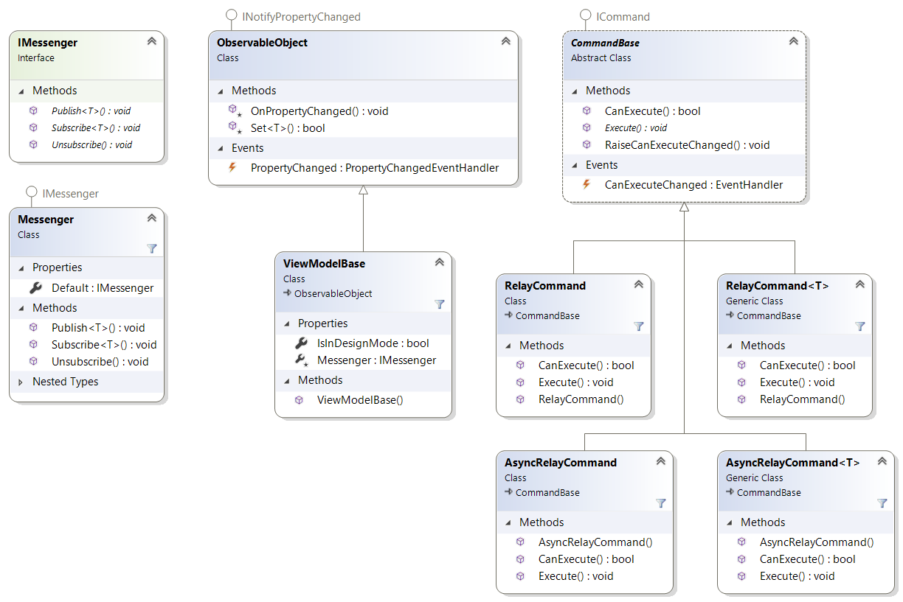

#  MvvmMicro
<a href="https://www.nuget.org/packages/MvvmMicro" target="_blank"></a>

A clean and lightweight MVVM framework for WPF, UWP and Xamarin.Forms inspired by MVVM Light Toolkit.

## Goals
- No third party dependencies, such as `CommonServiceLocator` or `System.Windows.Interactivity`.
- Avoid [feature kreep](https://en.wikipedia.org/wiki/Feature_creep) – only core MVVM types and services are included, such as `RelayCommand`, `ObservableObject` and a simple `IMessenger`.

## Supported platforms
- .NET Framework 4.5 (WPF)
- .NET Standard 2.0 (UWP, Xamarin.Forms)

## Downloads
The primary way to use MvvmMicro is by adding the [nuget](https://www.nuget.org/packages/MvvmMicro) package to your project:
```
Install-Package MvvmMicro
```

## Classes and Interfaces
Here's an overview of classes and interfaces exposed by the library:

